# 🤖 Text-to-SQL AI Database Assistant

> An AI-powered full-stack application that allows users to upload SQLite databases and interact with their data using natural language.

---

## 📌 Overview

**Text-to-SQL AI Database Assistant** converts natural-language questions into SQL queries and executes them against an uploaded SQLite database.

Instead of manually writing SQL, users can ask questions such as:

> **"Which customers have made the highest total payments?"**

The application understands the database schema, generates SQL using an LLM, validates and executes the query, automatically attempts correction when execution fails, and presents the results through tables and visualizations.

---

## ✨ Features

- 🗣️ Natural-language database querying
- 📂 SQLite database upload
- 🧠 Schema-aware SQL generation
- 🤖 LLM integration using Spring AI
- 🔐 JWT authentication
- 💬 Session-based conversations
- ✅ SQL validation before execution
- 🔄 Automatic SQL correction and retry
- 🗄️ Temporary runtime management of uploaded databases
- 📄 Backend pagination for query results
- 📊 Tabular data visualization
- 📈 Line, bar, and pie chart suggestions
- 🧩 ER diagram support
- 🔌 RESTful backend APIs
- 💾 PostgreSQL persistence for application data

---

# 🏗️ System Architecture

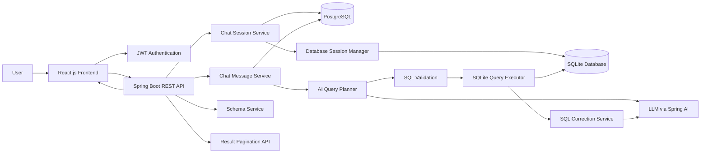

---

# 🧩 Backend Architecture

The backend follows a layered architecture where each layer has a specific responsibility.

```text
src/main/java/com/project/TextToSQL
│
├── Controller
│   ├── ChatSessionController
│   └── ChatMessageController
│
├── Service
│   ├── ChatMessageService
│   ├── AIQueryPlannerService
│   ├── SQLCorrectionService
│   ├── DatabaseSessionManager
│   └── SchemaMapper
│
├── Repository
│   ├── UserRepository
│   ├── ChatSessionRepository
│   └── ChatMessageRepository
│
├── Entity
│   ├── User
│   ├── ChatSession
│   └── ChatMessage
│
├── DTO
│   ├── ChatSessionsResponse
│   ├── SessionMessagesResponse
│   ├── QueryResultPage
│   └── VisualizationSuggestion
│
├── Security
│   ├── JwtAuthenticationFilter
│   └── SecurityConfig
│
└── Database
    └── SQLiteQueryExecutor
```

### Layer Responsibilities

| Layer | Responsibility |
|---|---|
| **Controller** | Handles HTTP requests and API responses |
| **Service** | Contains application business logic |
| **Repository** | Handles PostgreSQL persistence |
| **Entity** | Represents persistent application data |
| **DTO** | Defines API request and response structures |
| **Security** | JWT authentication and authorization |
| **AI Service** | Question classification and SQL generation |
| **SQLite Executor** | Executes SQL against uploaded databases |
| **Database Session Manager** | Manages runtime database files |
| **Schema Mapper** | Processes database schema information |

---

# 🔄 End-to-End Workflow

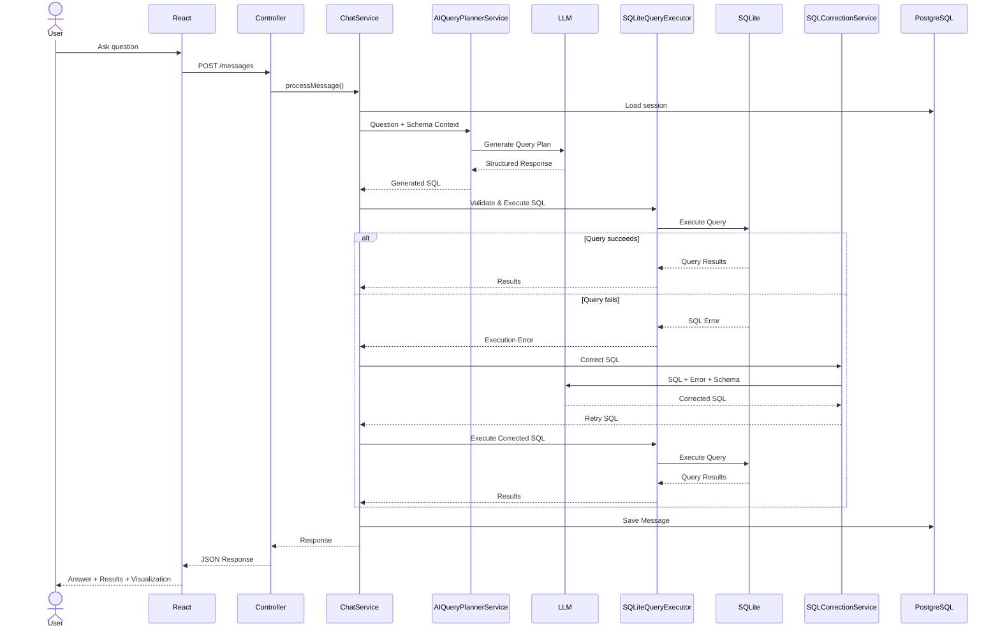

---

# 🧠 AI Query Processing

The LLM is not directly connected to the database.

The backend controls the complete query lifecycle.

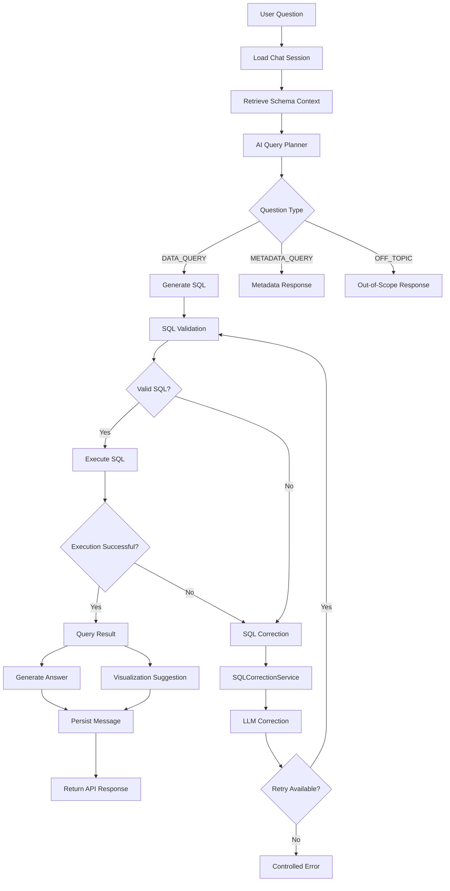

---

# 🔍 Query Classification

The AI planner classifies questions into three categories.

## `DATA_QUERY`

Questions that require data from the uploaded database.

Example:

```text
Which customers have made the highest total payments?
```

The system generates SQL and executes it.

## `METADATA_QUERY`

Questions about the database structure.

Example:

```text
What tables are available in this database?
```

These questions can be answered using the stored schema context.

## `OFF_TOPIC`

Questions unrelated to the uploaded database.

Example:

```text
What is the weather today?
```

The system avoids unnecessary SQL generation for these questions.

---

# 🧬 Schema-Aware SQL Generation

When a database is uploaded, the backend extracts its schema.

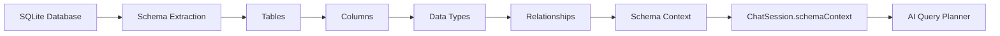

The LLM receives information about the actual database structure.

For example:

```text
Database Schema:

customers
    customer_id
    first_name
    last_name

payments
    payment_id
    customer_id
    amount
    payment_date

Relationship:

payments.customer_id -> customers.customer_id
```

This allows the model to generate SQL using the actual tables and columns instead of guessing the database structure.

---

# 🔄 SQL Validation & Self-Correction

AI-generated SQL can fail because of:

- Incorrect column names
- Incorrect table names
- SQL syntax errors
- Incorrect joins
- Database-specific SQL differences
- Incorrect assumptions about the schema

Instead of immediately returning an error, the backend attempts to correct the query.

```text
User Question
      │
      ▼
Generate SQL
      │
      ▼
Validate SQL
      │
      ▼
Execute SQL
      │
      ├─────────────── Success ───────────────► Result
      │
      ▼
    Error
      │
      ▼
SQL Correction Service
      │
      ▼
     LLM
      │
      ▼
Corrected SQL
      │
      ▼
    Retry
```

The correction process is bounded to prevent an uncontrolled retry loop.

---

# 🗄️ Database Architecture

The application uses **PostgreSQL** for application persistence and **SQLite** for the uploaded databases.

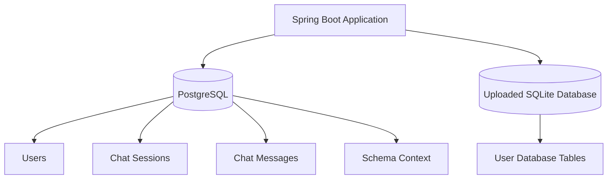

### PostgreSQL

Used for application-level data:

- Users
- Chat sessions
- Chat messages
- Schema context
- Query metadata

### SQLite

Used as the database uploaded by the user and queried through natural language.

---

# 📂 Database Session Management

Uploaded SQLite databases are associated with individual chat sessions.

The backend uses a `DatabaseSessionManager` to maintain the runtime relationship between:

```text
Chat Session ID
       │
       ▼
SQLite Database Path
       │
       ▼
SQLiteQueryExecutor
```

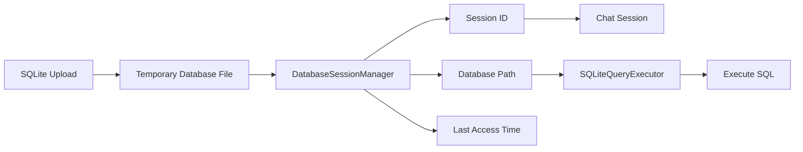

This keeps the application's persistent data separate from the uploaded database being queried.

---

# 🔐 Authentication & Security

The application uses **Spring Security with JWT authentication**.

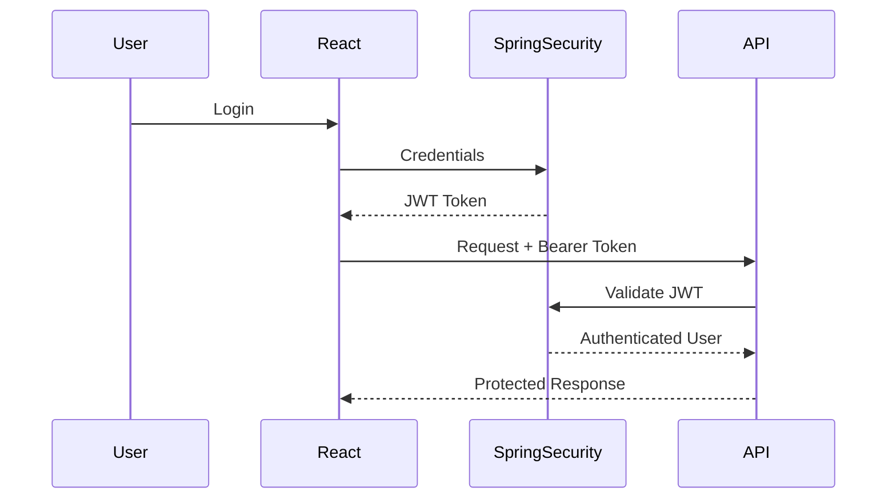

Protected requests use:

```http
Authorization: Bearer <JWT>
```

The authenticated user is also used when retrieving chat sessions, preventing users from accessing another user's sessions.

---

# 🔌 REST API

## Chat Sessions

### Get User Sessions

```http
GET /api/chat/sessions
```

Returns the authenticated user's chat sessions.

### Upload Database

```http
POST /api/chat/sessions/upload
```

Uploads a SQLite database and creates a chat session.

### Get Session

```http
GET /api/chat/sessions/{sessionId}
```

Retrieves the selected session and its messages.

### Get Schema

```http
GET /api/chat/sessions/{sessionId}/schema
```

Retrieves the database schema associated with the session.

## Chat

### Ask Question

```http
POST /api/chat/sessions/{sessionId}/messages
```

Processes a natural-language question and returns the AI-generated response.

## Query Results

### Get Paginated Results

```http
GET /api/chat/sessions/{sessionId}/messages/{messageId}/results?page=0&pageSize=50
```

Retrieves query results page by page.

---

# 📄 Backend Pagination

The backend does not send an unlimited number of database rows to the frontend.

Instead, query results are retrieved in pages.

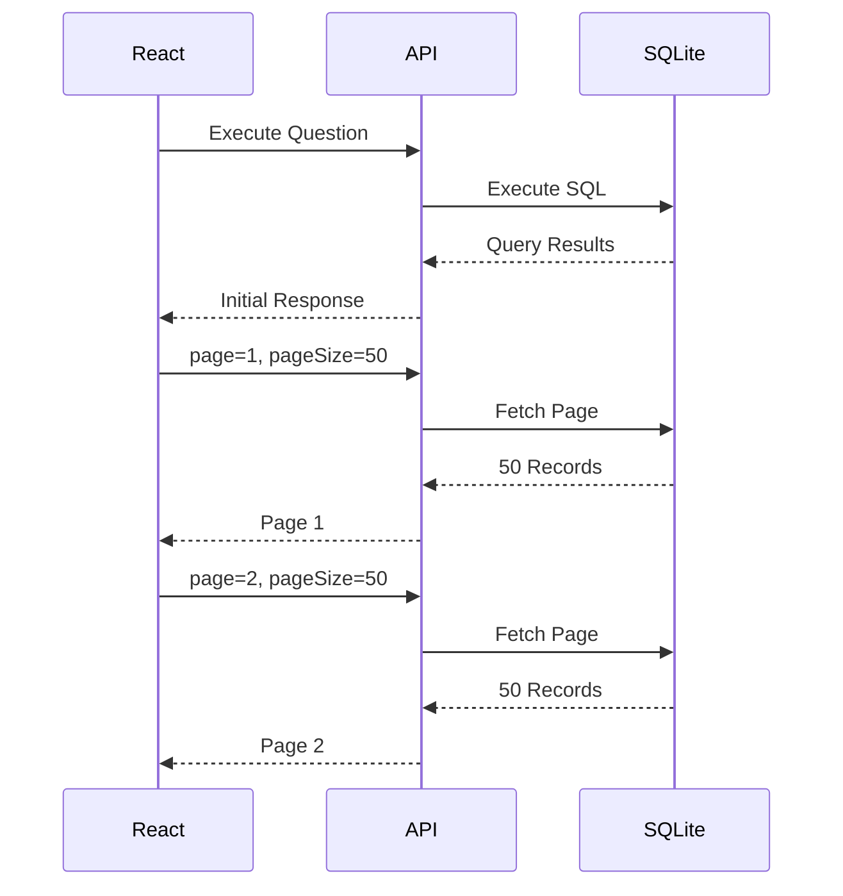

This reduces:

- API response size
- Browser memory usage
- Rendering overhead
- Initial response payload

---

# 📊 Visualization Workflow

The backend can return visualization suggestions along with query results.

Example:

```json
{
  "type": "LINE_CHART",
  "xAxis": "payment_date",
  "yAxis": "total_amount",
  "title": "Payments Over Time"
}
```

The React frontend uses the suggestion to render the appropriate visualization.

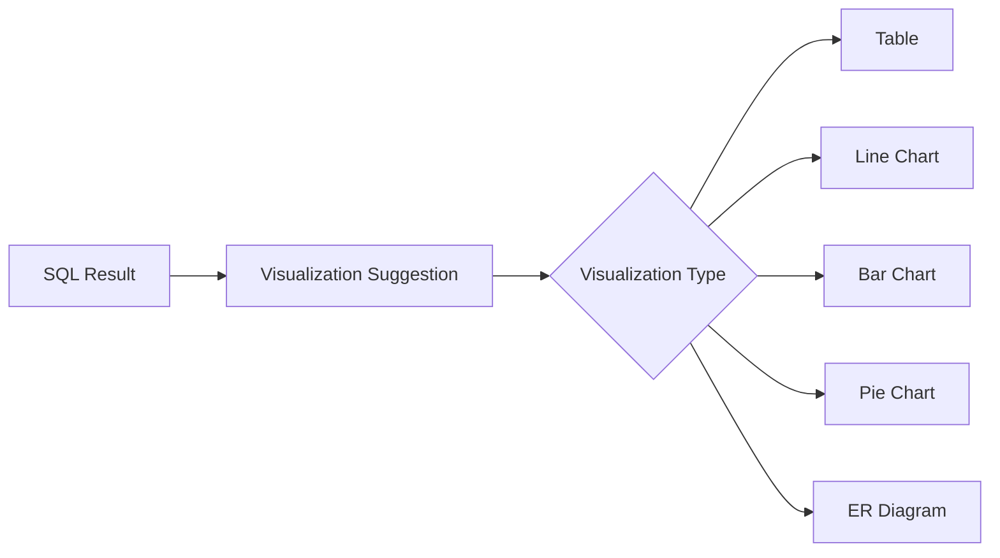

---

# ⚛️ Frontend Architecture

```text
React Application
│
├── Authentication
│   └── JWT Token Handling
│
├── Chat Context
│   ├── Sessions
│   ├── Selected Session
│   ├── Loading State
│   └── Messages
│
├── Session UI
│   ├── New Session
│   ├── Session History
│   └── Active Session
│
├── Chat UI
│   ├── MessageList
│   ├── UserMessage
│   └── AIMessage
│
├── Results
│   └── ResultTable
│
└── Visualizations
    ├── Charts
    └── ER Diagram
```

The frontend uses **React Context API** to manage session and chat state without excessive prop drilling.

---

# 🔄 Frontend Session Flow

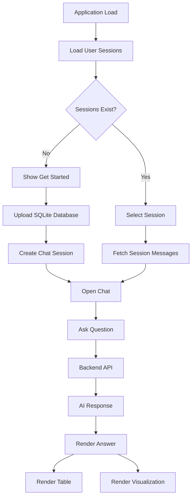

---

# 🗃️ Data Model

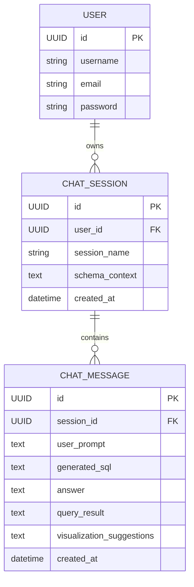

---

# 🧠 Engineering Decisions

## 1. Schema-Aware AI

The LLM receives the actual database schema rather than generating SQL blindly.

```text
Question
    +
Schema Context
    ↓
   LLM
    ↓
Generated SQL
```

This provides the model with the information required to reason about tables, columns, data types, and relationships.

## 2. AI Does Not Directly Execute SQL

The LLM generates SQL, but the backend controls execution.

```text
LLM
 ↓
Generated SQL
 ↓
Validation
 ↓
Execution
 ↓
Error Handling
 ↓
Correction / Retry
 ↓
Result
```

## 3. Bounded SQL Correction

A failed query can trigger an automated correction process.

```text
Generated SQL
      ↓
Execution
      ↓
    Error
      ↓
Correction
      ↓
Retry
```

The retry count is bounded to avoid uncontrolled loops.

## 4. Session-Based Architecture

Each uploaded database belongs to a chat session.

A session maintains:

```text
Session
├── Database Reference
├── Schema Context
├── Chat Messages
├── Generated SQL
├── Query Results
└── Visualization Metadata
```

This allows users to ask follow-up questions while maintaining the same database context.

## 5. Backend Pagination

Instead of sending potentially thousands of rows to the frontend:

```text
Database
   ↓
Backend
   ↓
Paginated API
   ↓
React
```

The frontend requests additional pages when required.

---

# 🛠️ Technology Stack

### Frontend

- React.js
- React Router
- Context API
- Axios
- Tailwind CSS
- Data visualization components

### Backend

- Java 21
- Spring Boot
- Spring Security
- Spring AI
- REST APIs
- JWT
- Maven

### Databases

- PostgreSQL / Supabase
- SQLite

### AI

- Spring AI
- LLM-based SQL generation
- Structured AI responses
- SQL correction workflow

---

# 📁 Project Structure

```text
TextToSQL/
│
├── src/
│   ├── main/
│   │   ├── java/
│   │   │   └── com/project/TextToSQL/
│   │   │       ├── Controller/
│   │   │       ├── Service/
│   │   │       ├── Repository/
│   │   │       ├── Entity/
│   │   │       ├── DTO/
│   │   │       ├── Security/
│   │   │       └── ...
│   │   │
│   │   └── resources/
│   │       └── application.yml
│   │
│   └── test/
│
├── pom.xml
├── Dockerfile
└── README.md
```

---

# 💬 Example Questions

The application can answer questions based on the schema of the uploaded database.

### Customer Analysis

```text
Which customers have made the highest total payments?
```

### Revenue Analysis

```text
Show monthly revenue for the last two years.
```

### Product Analysis

```text
Which product category generated the most revenue?
```

### Customer Distribution

```text
Show the distribution of customers by country.
```

### Employee Analysis

```text
Which employees handled the most orders?
```

The available questions depend on the schema of the uploaded database.

---

# 🔒 Security Considerations

The current architecture includes:

- JWT-based authentication
- Spring Security
- Authenticated REST endpoints
- Session ownership checks
- Backend-controlled SQL execution
- SQL validation before execution
- Bounded SQL correction attempts
- Separation between application PostgreSQL data and uploaded SQLite databases

---

# 📈 What This Project Demonstrates

This project combines backend engineering, database systems, frontend development, and AI integration.

### Backend Engineering

- REST API design
- Spring Boot architecture
- JWT authentication
- Authorization
- Service-layer design
- Repository pattern
- Session management
- File handling
- Runtime resource management

### Database Engineering

- PostgreSQL persistence
- SQLite database execution
- Schema extraction
- Dynamic SQL execution
- Query pagination

### AI Engineering

- LLM integration with Spring AI
- Schema-aware prompting
- Structured AI responses
- SQL generation
- SQL validation
- Automatic SQL correction
- Controlled retry workflow

### Frontend Engineering

- React.js
- Context API
- Axios
- Session management
- Chat interface
- Paginated result tables
- Data visualization

---

# 🎯 Core Engineering Principle

> **The LLM generates the query, but the backend owns the execution.**

```mermaid
flowchart LR
    USER[User]
    --> QUESTION[Natural Language Question]

    QUESTION --> LLM[LLM]

    LLM --> SQL[Generated SQL]

    SQL --> BACKEND[Spring Boot Backend]

    BACKEND --> VALIDATE[Validate]

    VALIDATE --> EXECUTE[Execute]

    EXECUTE --> DB[(SQLite)]

    DB --> RESULT[Query Result]

    RESULT --> REACT[React Frontend]

    REACT --> TABLE[Table / Chart]
```

This separation allows the AI layer to focus on **understanding and generating queries**, while the backend remains responsible for **validation, execution, error handling, persistence, security, and result delivery**.

---

# 👨‍💻 Author

**Varun Kumar**

B.Tech — Information Technology

Focused on **Java Backend Development, Spring Boot, Full-Stack Development, and AI-powered applications**.
